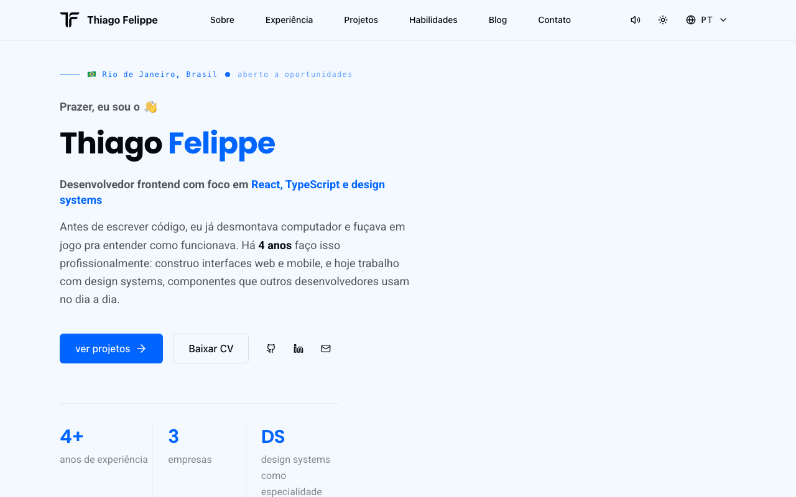

# Thiago Felippe — Portfolio

Personal portfolio built with Next.js, styled with my own design system ([`@tfds`](https://github.com/othiagofelippe/tf.ds)). Multi-language (pt/en/es), multi-theme, with a blog and a curated projects section.

🔗 [Live site](https://www.othiagofelippe.com)

## Features

- Sections: Hero, About, Experience (timeline), Projects, Skills, Blog, Contact
- i18n: `pt` / `en` / `es`, locale auto-detected from `Accept-Language`
- Themes: light (default), dark, and a custom "ocean-sunset" theme
- Blog with static post rendering (`generateStaticParams`)
- Respects `prefers-reduced-motion`

## Tech stack

- Next.js 15 (App Router), React 19, TypeScript (strict)
- Tailwind CSS v4, Turbopack
- [`@tfds`](https://github.com/othiagofelippe/tf.ds) — my own design system (`@tfds/react`, `@tfds/tokens`, `@tfds/icons`)
- Motion (`motion/react`) for animations
- next-themes for theming
- Deployed on Vercel with Vercel Analytics

## How to run

1. Clone this repository.
2. Install dependencies with `npm install`.
3. Run `npm run dev` and open `http://localhost:3000`.
